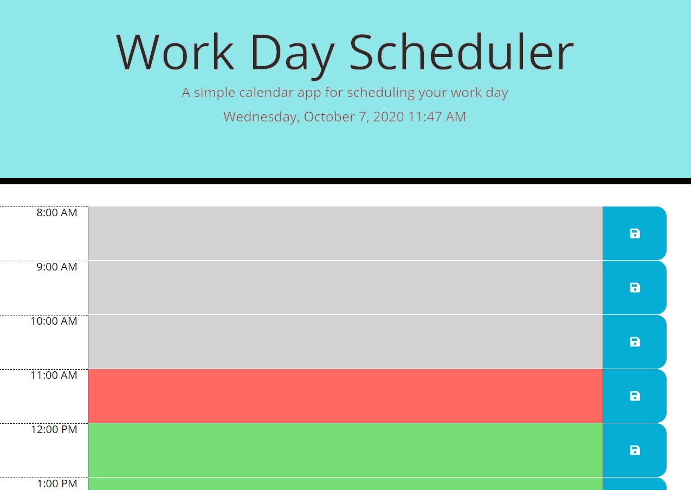
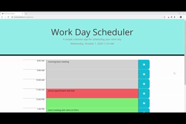

# Day Planner

Keep track of your daily tasks with this handy day planner!

## Table of Contents

1. [Usage](#Usage)
1. [Languages and Concepts](#Languages-and-Concepts)
1. [Method](#Method)
1. [Demo](#Demo)
1. [Roadmap](#Roadmap)
1. [Links](#Links)
1. [Contributing](#Contributing)
1. [License](#License)

## Usage

Having a busy work day means keeping track of your schedule and prioritizing tasks. Use this handy day planner to save your tasks each day, while looking forward to hitting the Clear Day button at the end of the day!

## Languages and Concepts
- HTML
- CSS
- JavaScript
- jQuery
- localStorage
- moment.js

## Method

To begin this project, I first identified what inputs and outputs were needed and established and linked my html, css and js files.

Next I added in the moment.js code to show the current date and time at the top of the planner. Using this API, the page will automatically display the current date and time, providing a seemless experience for the user. 

Now to establish my display, I created in the HTML rows with 3 columns each, to create a space for the time, the input and the save icon and determined what classes I needed for them, while adding some initial styling to aid in the visual of the planner. Then I added in the save icon using Font Awesome.

Then the next thing to establish is the state of the time blocks: if the specific time block is in the past, present or future. I did this by creating an if statement to compare the time block to the current hour.

Next I wrote an on click event to the save icon, to take the input from the textarea and save it in localStorage. I started with just the first time block to establish working code.

Then I decided to create a forEach function to iterate through an array of hours, set to the business hours in the 24 hour clock time and to use this function to create the rows and columns of the day planner rather in the HTML. 

While doing so, I also created an ID for each text area that would then match the hour of that time block, i.e. id: 8 at 8:00am. This would help with organizing the localStorage.

In addition, I created an if statement to convert from the 24 hour clock to the 12 hour clock and adding :00 and AM or PM to the time displayed on the planner.

I then also used the id's in an if statement to compare with the current hour (this variable also set to the 24 hour clock) to determine if the row is in the past, present, or future.

Next I worked on the code to set each text area to localStorage. I first adjusted the on click event to locate the id of its parent's sibling element and its content. I then had it take this information into an object, stringify it and set it to localStorage.

However as I worked my code, I came across two issues with this method: When trying to getItem from localStorage, I was having trouble sorting through what was in localStorage and what was on the page to determine if information was in localStorage and having it set it to the specifc row that it applied to. And my other issue I had was it loading multiple saves for the same id.

To solve this, I took a different approach and decided to have each row save to its own localStorage key: value pair.

While thinking about the usablility of this planner, I decided it needed a button at the bottom so the user could Clear the Day when all tasks were finished (rather than having to go input by input manually). So I added a Clear Day button at the bottom of the web page.

Finally to getItems from localStorage so the information persists on the web page even if the user refreshes the browser, I created a setPlans function to set the value of each hour row. I also added this function to the Clear Day button so that the rows would clear out properly.

To finish off, I added some styling adjustments to the text color and clear day button, along with some updated coloring to the jumbotron, and updating any comments and deleting any excess code.

## Demo

## Roadmap

To move forward with this project, the next feature I would like to add is an option for the user to input what their work hours are for the day. Whether they work different hours or longer hours, this would make it more customizable and usable for a wider variety of users. The next thing would be to add a color coding scheme to organize the type of task: work task, personal task, lunch break, appointment, urgent, etc.

## Links

- [Day Planner](https://ncmarsh.github.io/5_dayplanner/)
- [Project Repository](https://github.com/ncmarsh/5_dayplanner)

### Contributing

This is a personal project; no contributions are required at this time.

### License

No license granted.

##### [Return to Top of Page](#Day-Planner)